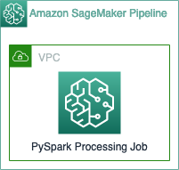

# Secure PySpark Pipeline example

This repository contains an Amazon SageMaker Pipeline structure to run a 
PySpark job inside a SageMaker Processing Job running in a secure environment.
It also enables the creation of a Spark UI from the pyspark logs generated by the execution.

## Solution Architecture


### Repository Structure
```
.
├── .gitignore
├── poetry.lock
├── pyproject.toml
├── README.md
├── requirements.txt
├── ml_pipeline                                 <--- code to generate your Amazon SageMaker Pipelines
│   ├── helpers                                 <--- support funtions to help you create your pipeline
│   │   ├── infra                               <--- Infrastructure related support functions
│   │   │   ├── networking                      <--- networking support functions
│   │   │   └── tags                            <--- tags support functions
│   │   ├── pipeline                            <--- Pipeline steps support function
│   │   │   └── steps                           
│   │   │       ├── processing                  <--- SageMaker Processing Jobs support function
│   │   │       ├── training                    <--- SageMaker Training Jobs support function
│   │   │       ├── transform                   <--- SageMaker Batch Transform Jobs support function
│   │   │       └── others                      <--- Other SageMaker services support functions
│   │   └── pipeline_utils.py                    <--- Pipeline general support functions
│   │── params                                  
│   │   └── pipeline_params.json                <--- Pipeline parameters   
│   └── pipeline.py                             <--- Pipeline creation file                  
├── notebook
│   └── Create_Iris_ParquetFiles.ipynb          <--- Example notebook
└── src                                         <--- Use case code where you develop your data processing and model training functionalities
    ├── helper                                  <--- support functions
    │   └── data_utils.py                       <--- common data processing functions
    ├── processing
    │   └── process_pyspark.py                  <--- PySpark data processing file
    └── spark_configuration
        └── configuration.json                  <--- pyspark configuration json

```

This repository provides a SageMaker Pipeline with examples of a PySpark Processing Job running inside-of a pre-deployed VPC.
An examples for a PySpark configuration file is also provided here

## Solution Deployment
###  Pre-requisites
This repo assumes it will be executed inside a secure SageMaker Studio deployment. 
To do so, you need to clone this repository in your SageMaker Studio deployment.

This repo also assumes that you have already deployed the following infrastructure:
* VPC configuration (subnets, security groups and VPC endpoints)
* KMS keys for encryption are already available on your AWS account.
* IAM role for the pipeline execution
* Infrastructure S3 bucket
* Data S3 bucket

You can also deploy a basic secure SageMaker Studio infrastructure using the provided AWS CloudFormation script at [prereq_infra/basic_infra.yaml](prereq_infra/basic_infra.yaml)

#### Deploying basic infrastructure
To deploy the provided basic infrastructure, you should first download the CloudFormation stack from this repository.

With the file available on your local computer, navigate to AWS CloudFormation on your AWS Console or click [here](https://console.aws.amazon.com/cloudformation/).

Click on the **Create Stack** button. 


Select the **Template is ready** option with **Upload a template file** as the Template source.
Next, choose the file you just downloaded as your template file.


Provide a stack name to your stack and click **Next** until the Create stack page.


Acknowledge that the AWS CloudFormation might create IAM resources and click on the **Create stack** button.


Your stack will be created. This can take a couple of minutes to complete. 
Once completed, a secure SageMaker Studio Domain and user will be available, navigate to SageMaker Studio to access it.


## Running Pipeline
To run the pipeline, you first need to clone this repository on your Amazon SageMaker Studio. To do so first open a terminal in your SageMaker Studio
and launch a terminal window


In your terminal, clone the repository:
```
git clone <repo_url>
```

### Updating pipeline parameters
This repository provides a general example of how to run your PySpark processing job in a secure environment. 
As you can bring your own infrastructure, you need to update the parameters used by this example accordingly.
The instructions below are on how to update the parameters considering the basic provided infrastructure.

#### Read deployed SSM parameters
The deployed CloudFormation stack also creates SSM parameters with the data that you need to update the parameter file.
To retrieve those, type the following command on your terminal window:
```
aws ssm get-parameters --names /pyspark/sagemaker-pipeline-execution-role-arn /pyspark/private-subnet-ids /pyspark/sagemaker-sg-ids /pyspark/kms-s3-key-arn /pyspark/infra-bucket /pyspark/data-bucket --query "Parameters[*].{Name:Name,Value:Value}"
```

Use the result of this query to update your `ml_pipeline/params/pipeline_params.json` file
to include your pre-requisites. You need to change the following parameters:
 * pipeline_role: the value of `/pyspark/sagemaker-pipeline-execution-role-arn`
 * infra_bucket: the value of `/pyspark/infra-bucket`
 * data_bucket: the value of `/pyspark/data-bucket`
 * network_subnet_ids: the value of `/pyspark/private-subnet-ids` split as two substrings
 * network_security_group_ids: the value of `/pyspark/sagemaker-sg-ids`
 * pyspark_process_volume_kms: the value of `/pyspark/kms-s3-key-arn`
 * pyspark_process_output_kms: the value of `/pyspark/kms-s3-key-arn`

After that you need to update your `ml_pipeline/run_pipeline_locally/run_pipeline.sh` file
to include your infra_bucket. You should replace `<INFRA_S3_BUCKET>` and `<DATA_S3_BUCKET>` by your buckets names (the values of the value of `/pyspark/infra-bucket` and `/pyspark/data-bucket`).


Once your parameters are configured, you can run your pipeline by executing the run_pipeline_locally file from a terminal.
First navigate to the file folder:

```
cd <repo_name>/ml_pipeline/run_pipeline_locally
```

Then execute the ```run_pipeline.sh``` file:

```
sh run_pipeline.sh
```

That will trigger the execution of your pipeline. To see all the available pipelines, you should navigate to the ```Pipeline``` SageMaker container.


### Visualizing Spark UI logs

You can run the notebook available at `notebook/View_Spark_UI.ipynb` to visualize your Spark UI logs.
Until the present moment, you won't be able to visualize SparkUI logs with SageMaker Studio. 
To do so, you need to create a SageMaker classical Notebook instance and clone your repository on it.