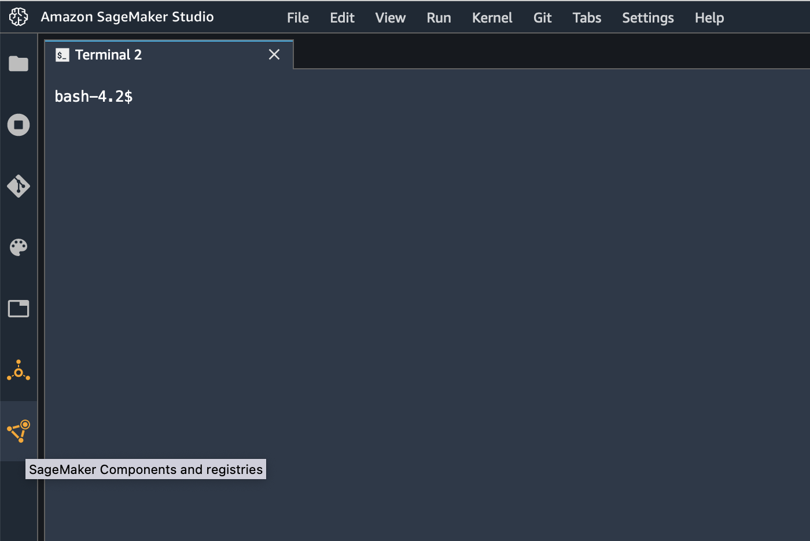
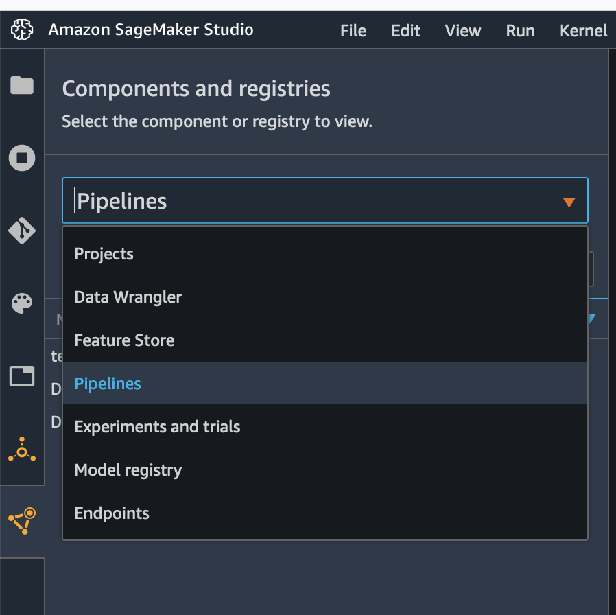

# Secure PySpark Pipeline example

This repository contains an Amazon SageMaker Pipeline structure to run a 
PySpark job inside a SageMaker Processing Job running inside a VPC with 
encryption enabled. It also enables the creation of a Spark UI from the pyspark 
logs generated by the execution.

## Solution Architecture


This repository provides a SageMaker Pipeline with examples of a PySpark Processing Job running inside-of a pre-deployed VPC.
Examples for a PySpark configuration file and data encryption are also provided here

## Solution Deployment
###  Pre-requisites
This repo assumes it will be executed inside SageMaker Studio. 
To do so, you need to clone this repository in your SageMaker Studio deployment.

This repo also assumes that you have already deployed the following infrastructure:
* VPC configuration (subnets, security groups and VPC endpoints)
* KMS keys for encryption are already available on your AWS account.
* IAM role for the pipeline execution
* Infrastructure S3 bucket
* Data S3 bucket

To configure your pre-requisites, you need to edit the `ml_pipeline/params/pipeline_params.json` file.

### Repository Structure
```
.
├── .gitignore
├── poetry.lock
├── pyproject.toml
├── README.md
├── requirements.txt
├── ml_pipeline                                 <--- code to generate your Amazon SageMaker Pipelines
│   ├── helpers                                 <--- support funtions to help you create your pipeline
│   │   ├── infra                               <--- Infrastructure related support functions
│   │   │   ├── networking                      <--- networking support functions
│   │   │   └── tags                            <--- tags support functions
│   │   ├── pipeline                            <--- Pipeline steps support function
│   │   │   └── steps                           
│   │   │       ├── processing                  <--- SageMaker Processing Jobs support function
│   │   │       ├── training                    <--- SageMaker Training Jobs support function
│   │   │       ├── transform                   <--- SageMaker Batch Transform Jobs support function
│   │   │       └── others                      <--- Other SageMaker services support functions
│   │   └── pipeline_utils.py                    <--- Pipeline general support functions
│   │── params                                  
│   │   └── pipeline_params.json                <--- Pipeline parameters   
│   └── pipeline.py                             <--- Pipeline creation file                  
├── notebook
│   └── Create_Iris_ParquetFiles.ipynb          <--- Example notebook
└── src                                         <--- Use case code where you develop your data processing and model training functionalities
    ├── helper                                  <--- support functions
    │   └── data_utils.py                       <--- common data processing functions
    ├── processing
    │   └── process_pyspark.py                  <--- PySpark data processing file
    └── spark_configuration
        └── configuration.json                  <--- pyspark configuration json

```

## Running Pipeline

To run the pipeline, you first need to clone this repository on your Amazon SageMaker Studio. To do so first open a terminal in your SageMaker Studio:


In your terminal, clone the repository:
```
git clone <repo_url>
```


Once you have the code available, you need to update your `ml_pipeline/params/pipeline_params.json` file
to include your pre-requisites. You need to change the following parameters:
 * pipeline_role: an IAM role with at least SageMaker, S3, KMS, CloudWatch permissions
 * infra_bucket: a s3 bucket to store your infrastructure data like code and parameters
 * data_bucket: an s3 bucket with your data
 * network_subnet_ids: your subnet ids
 * network_security_group_ids: your network security group ids
 * pyspark_process_volume_kms: the ARN of your KMS key that should be used for volume encryption
 * pyspark_process_output_kms: the ARN of your KMS key that should be used for output encryption

After that you need to update your `ml_pipeline/run_pipeline_locally/run_pipeline.sh` file
to include your infra_bucket. You should replace `<INFRA_BUCKET_NAME>` by your bucket name.


Once your parameters are configured, you can run your pipeline by executing the run_pipeline_locally file from a terminal.
First navigate to the file folder:

```
cd <repo_name>/ml_pipeline/run_pipeline_locally
```

Then execute the ```run_pipeline.sh``` file:

```
sh run_pipeline.sh
```

That will trigger the execution of your pipeline. To see all the available pipelines, you should navigate to the ```Pipeline``` SageMaker container.



